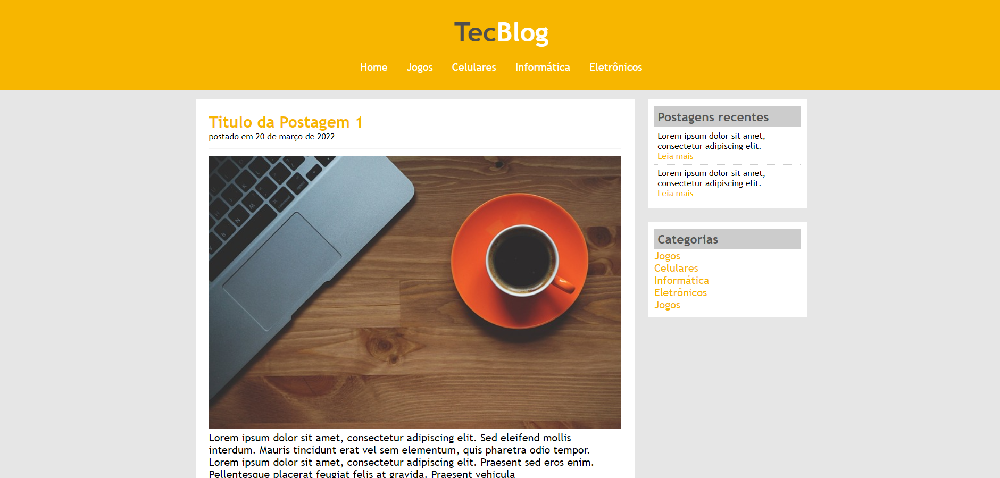
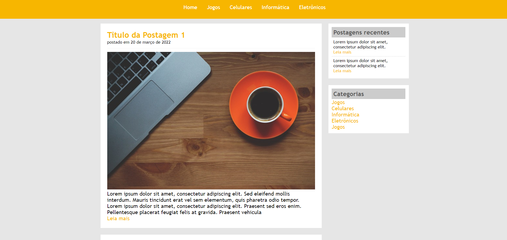

<h1>Projeto-TecBlog</h1>

O projeto <strong>TecBlog</strong> foi desenvolvido durante o curso "Desenvolvimento Web Completo 2020" ministrado por  Jorge Sant Ana e Jamilton Damasceno por meio da plataforma de ensino <a href ="https://www.udemy.com/">Udemy.<a>

Este projeto teve como objetivo criar um Front-end utilizando HTML e CSS para um Blog sobre tecnologia.

 
## Tecnologias utilizadas:

- [Html](https://www.w3schools.com/html/default.asp)
- [CSS](https://www.w3schools.com/css/)

## Front-end

## Licença

Esse projeto está sob a licença [MIT](./LICENSE). Veja o arquivo LICENSE para mais detalhes.

